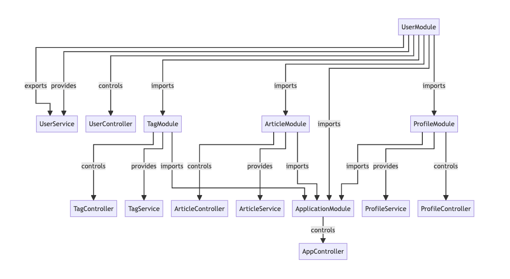

# NestJS Module Visualizer
The NestJS Module Visualizer is a command-line tool that analyzes the structure of a NestJS project, identifies modules, providers, controllers, and their relationships, and generates a Mermaid diagram to visualize the module interactions.

## Features
- Automatic Analysis: Analyzes the structure of a NestJS project directory.
- Mermaid Diagram Generation: Outputs a visual representation of the modules, their imports, exports, providers, and controllers.
- Customizable: Options to include or exclude specific modules in the visualization.

## Installation

1. Clone the repository:
```sh
git clone https://github.com/thakreyn/nestjs-module-visualizer.git
```

2. Navigate to the project directory:
```sh
cd nestjs-module-visualizer
```

3. Install the dependencies:

```sh
npm install
```

4. Usage - Command Line Interface

You can use the CLI to generate a Mermaid diagram from your NestJS project:

```sh
node dist/index.js /path/to/your/nestjs/project
```

#### Options
1. Exclude Modules: Use the --exclude option to exclude specific modules from the diagram.

```sh
node dist/index.js /path/to/your/nestjs/project --exclude=ModuleA,ModuleB
```

### Mermaid Diagram
The generated Mermaid diagram will illustrate the following relationships:

- Modules: Nodes representing NestJS modules.
- Imports: Directed edges showing module imports.
- Providers: Nodes showing the providers within each module.
- Controllers: Nodes showing the controllers within each module.
- Exports: Directed edges showing exported providers and services.

### Sample Output

Following is the code run on a sample NestJS repository by: [lujakob/nestjs-realworld-example-app](https://github.com/lujakob/nestjs-realworld-example-app)

```
graph TD
  %%{init: {'flowchart': {'defaultRenderer': 'elk'}}}%%
graph TD
  ApplicationModule
ArticleModule -->|imports| ApplicationModule
UserModule -->|imports| ApplicationModule
ProfileModule -->|imports| ApplicationModule
TagModule -->|imports| ApplicationModule
  ApplicationModule -->|controls| AppController
  ArticleModule
UserModule -->|imports| ArticleModule
  ArticleModule -->|provides| ArticleService
  ArticleModule -->|controls| ArticleController
  ProfileModule
UserModule -->|imports| ProfileModule
  ProfileModule -->|provides| ProfileService
  ProfileModule -->|controls| ProfileController
  TagModule
UserModule -->|imports| TagModule
  TagModule -->|provides| TagService
  TagModule -->|controls| TagController
  UserModule
  UserModule -->|provides| UserService
  UserModule -->|controls| UserController
  UserModule -->|exports| UserService
```

This code can then be passed on to a mermaid based generator like [mermaid-cli](https://github.com/mermaid-js/mermaid-cli) OR [mermaid.live](https://mermaid.live/edit#pako:eNpVkM1qw0AMhF9F6NRC_AI-FBq7zSUlgeZm-yC8sndJ9gd5TQi2373rmEKrk8R8M4iZsPWKMcfu5u-tJolwKWsHad6rQosZoqWhgSx7mw8cwXrHjxn2LwcPg_YhGNe_bvx-haCYjivGELVx12WTiqf_5HiGsjpSiD40f5XL3c_wUZmzTvH_FS2cXJ9VR3lHWUsCBUmDO7QsloxKr0-rocao2XKNeVoVybXG2i2JozH674drMY8y8g7Fj73GFHYb0jUGRZFLQ72Q_UVYmejlayvm2c_yA6rMX80) to get the associated diagram.

Following is the diagram for the above mermaid code:


## Future Scope / Contributing

I'm open to any ideas to expand on the projects. Feel free to play around with the project or raise issues for new ideas.
